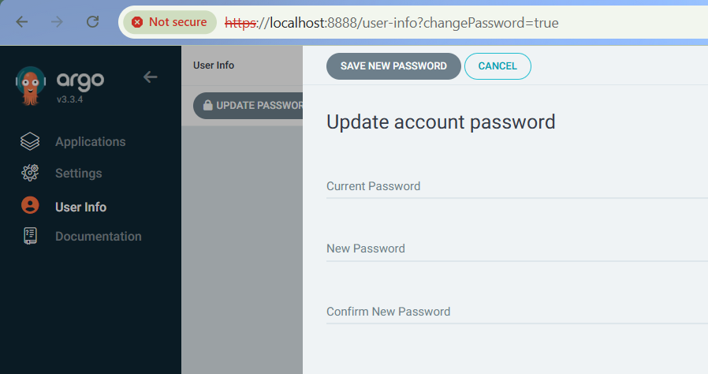
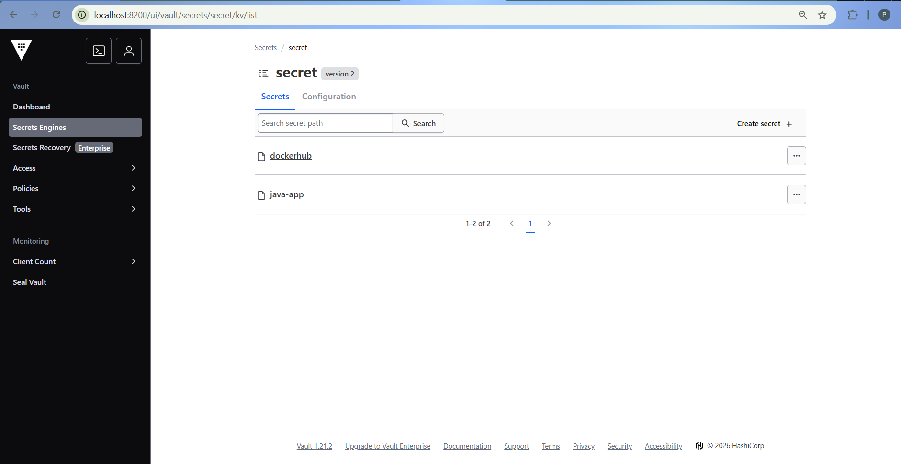
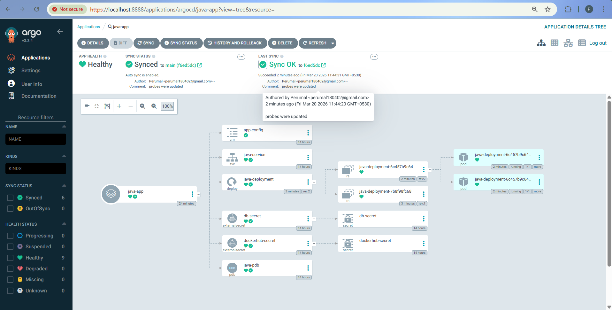

# 🚀 GitOps Deployment with ArgoCD, Vault & External Secrets (Kustomize)

This project demonstrates a **production-grade GitOps deployment pipeline** using:

* CD with ArgoCD
* Secret Management with Vault
* Secret Sync using External Secrets Operator (ESO)
* Environment-based deployments using Kustomize
* Deployment to Kubernetes (Kind cluster)

📌 **Note:**
The Docker image used in this project is built from a separate CI pipeline using Tekton.
👉 CI Repository: https://github.com/Perumal05/Tekton-CI

---

# 📌 Architecture Overview

```
GitHub Repo (Kustomize)
        ↓
      ArgoCD (GitOps)
        ↓
   Kubernetes (Kind Cluster)
        ↓
Vault → ESO → Kubernetes Secrets
```

---

# 📁 Repository Structure

```
.
├── base/
│   ├── deployment.yaml
│   ├── service.yaml
│   ├── pdb.yaml
│   └── kustomization.yaml
│
├── overlays/
│   └── dev/
│       ├── application.yaml
│       ├── kustomization.yaml
│       ├── deployment-patch.yaml
│       ├── externalsecret-app.yaml
│       ├── externalsecret-docker.yaml
│       ├── configmaps/
│       │   └── app.properties
│
└── assets/
    ├── argo-pass.png
    ├── argo-dashboard.png
    └── vault-dashboard.png
```

---

# ⚙️ Prerequisites

* Kubernetes cluster (Kind)
* kubectl
* Helm
* DockerHub account
* GitHub repository

---

# 🔷 Step 1: Install ArgoCD

```bash
kubectl create namespace argocd

kubectl create -f https://raw.githubusercontent.com/argoproj/argo-cd/stable/manifests/crds.yaml

kubectl create -n argocd -f https://raw.githubusercontent.com/argoproj/argo-cd/stable/manifests/install.yaml
```

### Verify Installation

```bash
kubectl get pods -n argocd
```

---

## 🌐 Access ArgoCD UI

```bash
kubectl port-forward svc/argocd-server -n argocd 8888:443
```

Open:

```
https://localhost:8888
```

---

## 🔐 Login

**Username:** `admin`

**Password:**

```bash
kubectl get secret argocd-initial-admin-secret \
-n argocd \
-o jsonpath="{.data.password}" |
ForEach-Object { [System.Text.Encoding]::UTF8.GetString([System.Convert]::FromBase64String($_)) }
```

👉 Change password after login



---

# 🔷 Step 2: Install Vault (Dev Mode)

```bash
kubectl create namespace vault

helm repo add hashicorp https://helm.releases.hashicorp.com
helm repo update

helm install vault hashicorp/vault \
--set server.dev.enabled=true \
--namespace vault
```

---

## 🌐 Access Vault UI

```bash
kubectl port-forward svc/vault 8200:8200 -n vault
```

Open:

```
http://localhost:8200
```

**Token:** `root`

---

## 🔐 Configure Vault

### Enable KV Engine

* Path: `secret`
* Version: `KV v2`

---

## 🔑 Add Secrets

### Application Secret

Path:

```
secret/java-app
```

Key:

```
password = my-db-password
```

---

### DockerHub Secret

Path:

```
secret/dockerhub
```

Keys:

```
username = YOUR_USERNAME
password = YOUR_PASSWORD
```

---



---

# 🔷 Step 3: Install External Secrets Operator (ESO)

```bash
kubectl create namespace external-secrets

helm repo add external-secrets https://charts.external-secrets.io
helm repo update

helm install external-secrets \
external-secrets/external-secrets \
-n external-secrets
```

---

## 🔑 Create Vault Token Secret

```bash
kubectl create secret generic vault-token \
--from-literal=token=root \
-n external-secrets
```

---

## 🔗 Configure ClusterSecretStore

```yaml
apiVersion: external-secrets.io/v1
kind: ClusterSecretStore
metadata:
  name: vault-backend
spec:
  provider:
    vault:
      server: "http://vault.vault.svc.cluster.local:8200"
      path: "secret"
      version: "v2"
      auth:
        tokenSecretRef:
          name: vault-token
          key: token
          namespace: external-secrets
```

```bash
kubectl apply -f clustersecretstore.yaml
```

---

# 🔷 Step 4: Base Kubernetes Manifests

## Deployment

* Uses DockerHub image
* Uses `imagePullSecrets`
* Resource limits defined

## Service

* ClusterIP
* Port mapping: `80 → 8080`

## PodDisruptionBudget

* Ensures minimum availability

---

# 🔷 Step 5: Kustomize (Environment-based)

### Dev Overlay Features

* Namespace: `dev`
* Name overrides:

  * Deployment → `java-deployment`
  * Service → `java-service`
  * PDB → `java-pdb`
* ConfigMap generation
* External Secrets integration

---

## ConfigMap

```
spring.application.name=demo
server.port=8080
```

---

# 🔷 Step 6: External Secrets

## Application Secret

```yaml
apiVersion: external-secrets.io/v1
kind: ExternalSecret
metadata:
  name: db-secret
spec:
  refreshInterval: 1h
  secretStoreRef:
    name: vault-backend
    kind: ClusterSecretStore
  target:
    name: db-secret
  data:
  - secretKey: DB_PASSWORD
    remoteRef:
      key: java-app
      property: password
```

---

## DockerHub Secret

```yaml
apiVersion: external-secrets.io/v1
kind: ExternalSecret
metadata:
  name: dockerhub-secret
spec:
  refreshInterval: 1h
  secretStoreRef:
    name: vault-backend
    kind: ClusterSecretStore
  target:
    name: dockerhub-secret
    template:
      type: kubernetes.io/dockerconfigjson
      data:
        .dockerconfigjson: |
          {
            "auths": {
              "https://index.docker.io/v1/": {
                "username": "{{ .username }}",
                "password": "{{ .password }}",
                "auth": "{{ printf "%s:%s" .username .password | b64enc }}"
              }
            }
          }
  data:
  - secretKey: username
    remoteRef:
      key: dockerhub
      property: username
  - secretKey: password
    remoteRef:
      key: dockerhub
      property: password
```

---

# 🔷 Step 7: Deploy via ArgoCD

## Create Namespace

```bash
kubectl create namespace dev
```

---

## Apply Application

```bash
kubectl apply -f overlays/dev/application.yaml
```

---

## Verify

```bash
kubectl get applications -n argocd
```

---

# 🔷 Step 8: Access Application

```bash
kubectl port-forward svc/java-service 9999:80 -n dev
```

Open:

```
http://localhost:9999
```

---



---

# 🔥 Key Features Implemented

✅ GitOps using ArgoCD
✅ Secure secret management using Vault
✅ Dynamic secret injection via ESO
✅ Environment-based deployments (Kustomize)
✅ DockerHub private image pull via ESO
✅ Kubernetes best practices (PDB, resources)

---

# 🎯 Conclusion

This project demonstrates a **complete GitOps-based Kubernetes deployment setup** integrating:

* ArgoCD for continuous delivery
* Vault + ESO for secure secret management
* Kustomize for environment-based configuration


